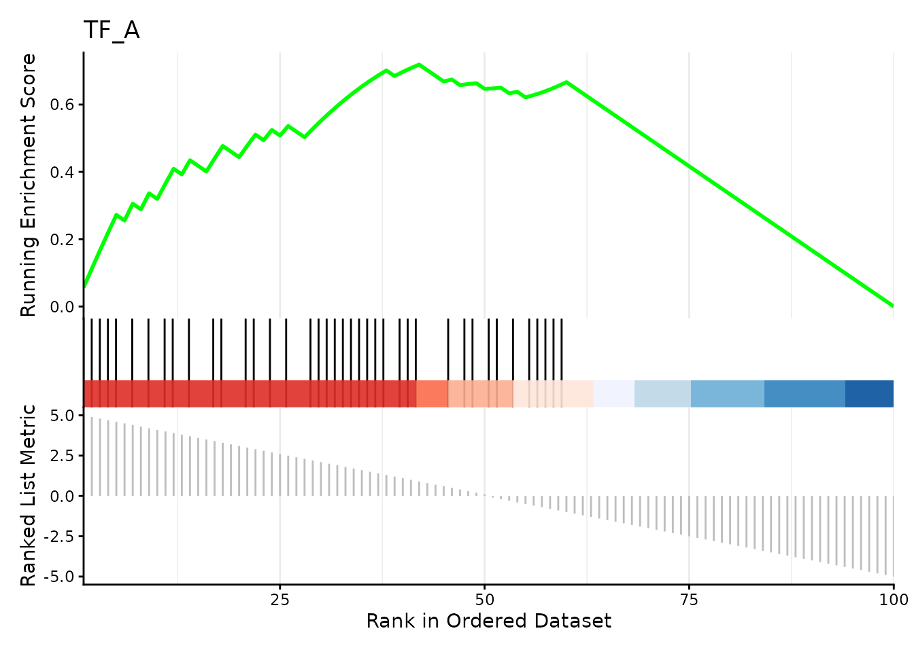

# Peak-Set Enrichment Analysis with PeakSEA

## Introduction

### What is PeakSEA?


Peak-Set Enrichment Analysis (PeakSEA) is a computational method for
identifying which *peak sets* — collections of genomic regions sharing a
biological property — are over-represented among peaks that are
differentially regulated between conditions.

PeakSEA adapts the Gene Set Enrichment Analysis (GSEA) framework
(Subramanian et al., 2005) to genomic ranges data. The key conceptual
differences are:

| GSEA | PeakSEA |
|----|----|
| Input: genes ranked by differential expression | Input: peaks ranked by differential accessibility |
| Gene sets (e.g. GO terms, pathways) | Peak sets (e.g. ATAC peaks, DHS, histone marks) |
| Membership defined by gene identifier | Membership defined by genomic coordinate overlap |

The approach can for example be applied to chromatin accessibility
experiments where one wishes to ask: *“Do peaks near binding sites of TF
X tend to be more open in condition A?”*

### Algorithm overview

    Ranked peaks (gr)               Peak set database (gr_set)
      chr1:1000-1499  log2FC=3.1        chr1:1050-1550  term="CTCF"
      chr1:2000-2499  log2FC=2.7    ──► chr1:2100-2600  term="CTCF"
      chr2:500-999    log2FC=-1.2       chr3:800-1300   term="H3K27ac"
      ...                               ...
            │
            │  1. Overlap peaks with peak sets
            ▼
      Annotate each peak with the term(s) it overlaps
            │
            │  2. Build ranked gene-set input for GSEA
            ▼
      TERM2GENE data frame  +  named ranked vector
            │
            │  3. Run GSEA (clusterProfiler)
            ▼
      gseaResult: NES, p-value, FDR per peak set

## Input data

### Ranked peaks (`gr`)

`gr` must be a `GRanges` object whose metadata contains a *quantitative
ranking metric*. Common choices:

- `log2FC` from a differential accessibility test (e.g. DESeq2, edgeR)
- Signed $`-\log_{10}(p\text{-value})`$
- Any continuous score where larger values indicate stronger signal in
  the condition of interest

``` r

library(PeakSEA)
library(plyranges)

set.seed(1979)

# 100 simulated ATAC-seq peaks with strong signal:
#   peaks 1–50 are upregulated (positive log2FC)
#   peaks 51–100 are downregulated (negative log2FC)
peaks <- data.frame(
  seqnames = "chr1",
  start    = seq(1e4, by = 1e3, length.out = 100),
  width    = 500L,
  log2FC   = c(seq(5, 0.1, length.out = 50),
               seq(-0.1, -5, length.out = 50)),
  padj     = runif(100, 0, 0.05)
) |>
  plyranges::as_granges()

peaks
#> GRanges object with 100 ranges and 2 metadata columns:
#>         seqnames        ranges strand |    log2FC       padj
#>            <Rle>     <IRanges>  <Rle> | <numeric>  <numeric>
#>     [1]     chr1   10000-10499      * |       5.0 0.04544498
#>     [2]     chr1   11000-11499      * |       4.9 0.02410026
#>     [3]     chr1   12000-12499      * |       4.8 0.01264799
#>     [4]     chr1   13000-13499      * |       4.7 0.03642297
#>     [5]     chr1   14000-14499      * |       4.6 0.00827964
#>     ...      ...           ...    ... .       ...        ...
#>    [96]     chr1 105000-105499      * |      -4.6  0.0119499
#>    [97]     chr1 106000-106499      * |      -4.7  0.0375665
#>    [98]     chr1 107000-107499      * |      -4.8  0.0201940
#>    [99]     chr1 108000-108499      * |      -4.9  0.0232156
#>   [100]     chr1 109000-109499      * |      -5.0  0.0108765
#>   -------
#>   seqinfo: 1 sequence from an unspecified genome; no seqlengths
```

### Peak set database (`gr_set`)

`gr_set` is a `GRanges` object where every range is annotated with a
`"term"` metadata column naming the peak set it belongs to. This mirrors
the TERM2GENE format used by
*[clusterProfiler](https://bioconductor.org/packages/3.23/clusterProfiler)*.

Peak sets can represent, for example:

- **TF binding sites** from ChIP-seq experiments (ENCODE, ReMap)
- **Chromatin states** from histone mark ChIP-seq (Roadmap Epigenomics)
- **DHS clusters** from DNase-seq
- Any custom collection of genomic intervals

Public databases such as [LOLA](http://databio.org/regiondb) and
[AnnotationHub](https://bioconductor.org/packages/AnnotationHub/)
provide pre-built region sets that can be used directly as `gr_set`.

For this vignette we create two synthetic peak sets that mimic TF
binding sites overlapping a known subset of our differential peaks:

``` r

# "TF_A" binding sites overlap the upregulated peaks
# "TF_B" binding sites overlap the downregulated peaks
set.seed(1979)
peak_sets <- c(
  shift_right(peaks[sample(1:60, 40)],  100L) |> mutate(term = "TF_A"),
  shift_right(peaks[sample(40:100, 40)], 100L) |> mutate(term = "TF_B")
)

peak_sets
#> GRanges object with 80 ranges and 3 metadata columns:
#>        seqnames      ranges strand |    log2FC      padj        term
#>           <Rle>   <IRanges>  <Rle> | <numeric> <numeric> <character>
#>    [1]     chr1 55100-55599      * |       0.5 0.0270753        TF_A
#>    [2]     chr1 46100-46599      * |       1.4 0.0462161        TF_A
#>    [3]     chr1 11100-11599      * |       4.9 0.0241003        TF_A
#>    [4]     chr1 68100-68599      * |      -0.9 0.0210772        TF_A
#>    [5]     chr1 41100-41599      * |       1.9 0.0348013        TF_A
#>    ...      ...         ...    ... .       ...       ...         ...
#>   [76]     chr1 56100-56599      * |       0.4 0.0308319        TF_B
#>   [77]     chr1 60100-60599      * |      -0.1 0.0212098        TF_B
#>   [78]     chr1 50100-50599      * |       1.0 0.0279952        TF_B
#>   [79]     chr1 69100-69599      * |      -1.0 0.0120466        TF_B
#>   [80]     chr1 98100-98599      * |      -3.9 0.0105650        TF_B
#>   -------
#>   seqinfo: 1 sequence from an unspecified genome; no seqlengths
```

## Running PeakSEA

Call [`psea()`](https://immuneaxisa.github.io/PeakSEA/reference/psea.md)
with the ranked peaks, the name of the ranking column, and the peak set
database. Additional arguments are forwarded to
[`plyranges::join_overlap_left()`](https://tidyomics.github.io/plyranges/reference/overlap-joins.html)
(e.g. `maxgap`, `minoverlap`) to control how overlaps between `gr` and
`gr_set` are computed.

``` r

result <- psea(peaks, log2FC, peak_sets)

result
#> #
#> # Gene Set Enrichment Analysis
#> #
#> #...@organism     unknown 
#> #...@setType      unknown 
#> #...@keytype      unknown 
#> #...@geneList     Named num [1:100] 5 4.9 4.8 4.7 4.6 4.5 4.4 4.3 4.2 4.1 ...
#>  - attr(*, "names")= chr [1:100] "chr1_10000_10499" "chr1_11000_11499" "chr1_12000_12499" "chr1_13000_13499" ...
#> #...nPerm     1000 
#> #...pvalues adjusted by 'BH' with cutoff < 0.05
#> #...2 enriched terms found
#> 'data.frame':    2 obs. of  12 variables:
#>  $ ID             : chr  "TF_B" "TF_A"
#>  $ Description    : chr  "TF_B" "TF_A"
#>  $ setSize        : int  40 40
#>  $ enrichmentScore: num  -0.759 0.719
#>  $ NES            : num  -3.03 2.83
#>  $ pvalue         : num  1.62e-10 4.44e-09
#>  $ p.adjust       : num  3.25e-10 4.44e-09
#>  $ qvalue         : num  NA NA
#>  $ rank           : int  45 42
#>  $ leading_edge   : chr  "tags=80%, list=45%, signal=73%" "tags=72%, list=42%, signal=70%"
#>  $ core_enrichment: chr  "chr1_66000_66499/chr1_67000_67499/chr1_68000_68499/chr1_69000_69499/chr1_71000_71499/chr1_72000_72499/chr1_7300"| __truncated__ "chr1_10000_10499/chr1_11000_11499/chr1_12000_12499/chr1_13000_13499/chr1_14000_14499/chr1_16000_16499/chr1_1800"| __truncated__
#>  $ log2err        : num  0.827 0.761
#> #...Citation
#> S Xu, E Hu, Y Cai, Z Xie, X Luo, L Zhan, W Tang, Q Wang, B Liu, R Wang, W Xie, T Wu, L Xie, G Yu. Using clusterProfiler to characterize multiomics data. Nature Protocols. 2024, 19(11):3292-3320
```

The result is a `gseaResult` object. The embedded result table can be
accessed as a data frame:

``` r

knitr::kable(as.data.frame(result)[, c("ID", "NES", "pvalue", "p.adjust")])
```

|      | ID   |       NES | pvalue | p.adjust |
|:-----|:-----|----------:|-------:|---------:|
| TF_B | TF_B | -3.026348 |      0 |        0 |
| TF_A | TF_A |  2.833434 |      0 |        0 |

**Interpreting the output:**

- **NES \> 0**: the peak set is enriched among *upregulated* peaks (top
  of the ranked list).
- **NES \< 0**: the peak set is enriched among *downregulated* peaks
  (bottom of the ranked list).
- **p.adjust**: FDR (Benjamini–Hochberg by default).

As expected, *TF_A* (associated with upregulated peaks) has a positive
NES, while *TF_B* (associated with downregulated peaks) has a negative
NES.

## Visualisation

*[enrichplot](https://bioconductor.org/packages/3.23/enrichplot)*
provides ready-made plots for `gseaResult` objects.

The enrichment curve for an individual peak set shows how its members
are distributed across the ranked peak list:

``` r

if (requireNamespace("enrichplot", quietly = TRUE)) {
  enrichplot::gseaplot2(result, geneSetID = "TF_A", title = "TF_A")
}
```



## Building a peak set database from public resources

In a real analysis, `gr_set` is typically built from an external
database. Below is a minimal sketch using
*[AnnotationHub](https://bioconductor.org/packages/3.23/AnnotationHub)*:

``` r

library(AnnotationHub)
ah <- AnnotationHub()

# Search for ENCODE CTCF ChIP-seq peaks in hg38
ctcf_hits <- query(ah, c("CTCF", "Homo sapiens", "ENCODE"))

# Download Gm12878 cell line data
ctcf_gr <- ah[["AH22521"]]

# Annotate with a term column and combine multiple experiments
ctcf_gr$term <- "CTCF_ENCODE"

# Pass as gr_set
result <- psea(my_atac_peaks, log2FC, ctcf_gr)
```

For collections of many peak sets, concatenate individual `GRanges`
objects with [`c()`](https://rdrr.io/r/base/c.html) before passing to
[`psea()`](https://immuneaxisa.github.io/PeakSEA/reference/psea.md).

## Session information

``` r

sessionInfo()
#> R version 4.6.0 (2026-04-24)
#> Platform: x86_64-pc-linux-gnu
#> Running under: Ubuntu 24.04.4 LTS
#> 
#> Matrix products: default
#> BLAS:   /usr/lib/x86_64-linux-gnu/openblas-pthread/libblas.so.3 
#> LAPACK: /usr/lib/x86_64-linux-gnu/openblas-pthread/libopenblasp-r0.3.26.so;  LAPACK version 3.12.0
#> 
#> locale:
#>  [1] LC_CTYPE=C.UTF-8       LC_NUMERIC=C           LC_TIME=C.UTF-8       
#>  [4] LC_COLLATE=C.UTF-8     LC_MONETARY=C.UTF-8    LC_MESSAGES=C.UTF-8   
#>  [7] LC_PAPER=C.UTF-8       LC_NAME=C              LC_ADDRESS=C          
#> [10] LC_TELEPHONE=C         LC_MEASUREMENT=C.UTF-8 LC_IDENTIFICATION=C   
#> 
#> time zone: UTC
#> tzcode source: system (glibc)
#> 
#> attached base packages:
#> [1] stats4    stats     graphics  grDevices utils     datasets  methods  
#> [8] base     
#> 
#> other attached packages:
#>  [1] plyranges_1.32.0     dplyr_1.2.1          GenomicRanges_1.64.0
#>  [4] Seqinfo_1.2.0        IRanges_2.46.0       S4Vectors_0.50.1    
#>  [7] BiocGenerics_0.58.1  generics_0.1.4       PeakSEA_0.1.0       
#> [10] BiocStyle_2.40.0    
#> 
#> loaded via a namespace (and not attached):
#>   [1] RColorBrewer_1.1-3          jsonlite_2.0.0             
#>   [3] tidydr_0.0.6                magrittr_2.0.5             
#>   [5] ggtangle_0.1.2              farver_2.1.2               
#>   [7] rmarkdown_2.31              BiocIO_1.22.0              
#>   [9] fs_2.1.0                    ragg_1.5.2                 
#>  [11] vctrs_0.7.3                 memoise_2.0.1              
#>  [13] Rsamtools_2.28.0            RCurl_1.98-1.18            
#>  [15] ggtree_4.2.0                htmltools_0.5.9            
#>  [17] S4Arrays_1.12.0             curl_7.1.0                 
#>  [19] SparseArray_1.12.2          gridGraphics_0.5-1         
#>  [21] sass_0.4.10                 bslib_0.11.0               
#>  [23] htmlwidgets_1.6.4           desc_1.4.3                 
#>  [25] plyr_1.8.9                  httr2_1.2.2                
#>  [27] cachem_1.1.0                GenomicAlignments_1.48.0   
#>  [29] igraph_2.3.1                lifecycle_1.0.5            
#>  [31] pkgconfig_2.0.3             Matrix_1.7-5               
#>  [33] R6_2.6.1                    fastmap_1.2.0              
#>  [35] gson_0.1.0                  MatrixGenerics_1.24.0      
#>  [37] digest_0.6.39               aplot_0.2.9                
#>  [39] enrichplot_1.32.0           ggnewscale_0.5.2           
#>  [41] patchwork_1.3.2             AnnotationDbi_1.74.0       
#>  [43] aisdk_1.1.0                 ps_1.9.3                   
#>  [45] textshaping_1.0.5           RSQLite_3.52.0             
#>  [47] labeling_0.4.3              httr_1.4.8                 
#>  [49] polyclip_1.10-7             abind_1.4-8                
#>  [51] compiler_4.6.0              bit64_4.8.0                
#>  [53] fontquiver_0.2.1            withr_3.0.2                
#>  [55] S7_0.2.2                    BiocParallel_1.46.0        
#>  [57] DBI_1.3.0                   ggforce_0.5.0              
#>  [59] MASS_7.3-65                 rappdirs_0.3.4             
#>  [61] DelayedArray_0.38.1         rjson_0.2.23               
#>  [63] tools_4.6.0                 ape_5.8-1                  
#>  [65] scatterpie_0.2.6            glue_1.8.1                 
#>  [67] restfulr_0.0.16             callr_3.7.6                
#>  [69] nlme_3.1-169                GOSemSim_2.38.0            
#>  [71] grid_4.6.0                  cluster_2.1.8.2            
#>  [73] reshape2_1.4.5              gtable_0.3.6               
#>  [75] tidyr_1.3.2                 XVector_0.52.0             
#>  [77] ggrepel_0.9.8               pillar_1.11.1              
#>  [79] stringr_1.6.0               yulab.utils_0.2.4          
#>  [81] splines_4.6.0               tweenr_2.0.3               
#>  [83] treeio_1.36.1               lattice_0.22-9             
#>  [85] rtracklayer_1.72.0          bit_4.6.0                  
#>  [87] tidyselect_1.2.1            fontLiberation_0.1.0       
#>  [89] GO.db_3.23.1                Biostrings_2.80.0          
#>  [91] knitr_1.51                  fontBitstreamVera_0.1.1    
#>  [93] SummarizedExperiment_1.42.0 xfun_0.57                  
#>  [95] Biobase_2.72.0              matrixStats_1.5.0          
#>  [97] stringi_1.8.7               lazyeval_0.2.3             
#>  [99] ggfun_0.2.0                 yaml_2.3.12                
#> [101] cigarillo_1.2.0             codetools_0.2-20           
#> [103] evaluate_1.0.5              gdtools_0.5.0              
#> [105] tibble_3.3.1                qvalue_2.44.0              
#> [107] BiocManager_1.30.27         ggplotify_0.1.3            
#> [109] cli_3.6.6                   systemfonts_1.3.2          
#> [111] processx_3.9.0              jquerylib_0.1.4            
#> [113] Rcpp_1.1.1-1.1              png_0.1-9                  
#> [115] XML_3.99-0.23               parallel_4.6.0             
#> [117] pkgdown_2.2.0               ggplot2_4.0.3              
#> [119] blob_1.3.0                  clusterProfiler_4.20.0     
#> [121] DOSE_4.6.0                  bitops_1.0-9               
#> [123] tidytree_0.4.7              ggiraph_0.9.6              
#> [125] enrichit_0.1.4              scales_1.4.0               
#> [127] purrr_1.2.2                 crayon_1.5.3               
#> [129] rlang_1.2.0                 KEGGREST_1.52.0
```
